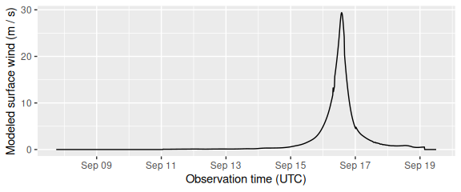

<!-- README.md is generated from README.Rmd. Please edit that file -->

[](https://cran.r-project.org/package=stormwindmodel)

## Overview

The `stormwindmodel` package was created to allow users to model wind
speeds at grid points in the United States based on “best tracks”
hurricane tracking data, using a model for wind speed developed by
Willoughby and coauthors (2006). The package includes functions for
interpolating hurricane tracks and for modeling and mapping wind speeds
during the storm. It includes population mean center locations for all
U.S. counties, which can be used to map winds by county; however, other
grid point locations can also be input for modeling. Full details on how
this model is fit are provided in the “Details” vignette of the
`stormwindmodel` package.

This package is currently in development on GitHub. You can install it
using the `install_github` function from the `devtools` package using:

``` r
devtools::install_github("geanders/stormwindmodel", build_vignettes = TRUE)
```

## Package example data

For examples, the package includes data on the tracks of Hurricane Floyd
in 1999 and Hurricane Katrina in 2005. You can load these example best
tracks data sets using:

``` r
library(stormwindmodel)
data("floyd_tracks")
head(floyd_tracks)
#> # A tibble: 6 × 4
#>   date         latitude longitude  wind
#>   <chr>           <dbl>     <dbl> <dbl>
#> 1 199909071800     14.6     -45.6    25
#> 2 199909080000     15       -46.9    30
#> 3 199909080600     15.3     -48.2    35
#> 4 199909081200     15.8     -49.6    40
#> 5 199909081800     16.3     -51.1    45
#> 6 199909090000     16.7     -52.6    45
data("katrina_tracks")
head(katrina_tracks)
#> # A tibble: 6 × 4
#>   date         latitude longitude  wind
#>   <chr>           <dbl>     <dbl> <dbl>
#> 1 200508231800     23.1     -75.1    30
#> 2 200508240000     23.4     -75.7    30
#> 3 200508240600     23.8     -76.2    30
#> 4 200508241200     24.5     -76.5    35
#> 5 200508241800     25.4     -76.9    40
#> 6 200508250000     26       -77.7    45
```

This example data includes the following columns:

- `date`: Date and time of the observation (in UTC)
- `latitude`, `longitude`: Location of the storm at that time
- `wind`: Maximum wind speed at that time (knots)

You can input other storm tracks into the wind modeling functions in the
`stormwindmodel` package, but you must have your storm tracks in the
same format as these example dataframes and with these columns names to
input the tracks to the functions in `stormwindmodel`. If necessary, use
`rename` from `dplyr` to rename columns and `convert_wind_speed` from
`weathermetrics` to convert windspeed into knots.

The `stormwindmodel` package also includes a dataset with the location
of the population mean center of each U.S. county (`county_points`).
This dataset can be used as the grid point inputs if you want to model
storm-related winds for counties. These counties are listed by Federal
Information Processing Standard (FIPS) number, which uniquely identifies
each U.S. county. This dataset comes from the US Census [file of county
population mean center
locations](http://www2.census.gov/geo/docs/reference/cenpop2010/county/CenPop2010_Mean_CO.txt),
as of the 2010 Census.

``` r
data(county_points)
head(county_points)
#>   gridid     glat      glon glandsea
#> 1  01001 32.50039 -86.49416     TRUE
#> 2  01003 30.54892 -87.76238     TRUE
#> 3  01005 31.84404 -85.31004     TRUE
#> 4  01007 33.03092 -87.12766     TRUE
#> 5  01009 33.95524 -86.59149     TRUE
#> 6  01011 32.11633 -85.70119     TRUE
```

You can use a different dataset of grid points to model winds at other
U.S. locations, including across evenly spaced grid points. However, you
will need to include these grid points in a dataframe with a similar
format to this example dataframe, with columns for each grid point id
(`gridid`— these IDs can be random but should be unique across grid
points), and `glat` and `glon` for latitude and longitude of each grid
point.

## Basic example

The main function of this package is `get_grid_winds`. It inputs storm
tracks for a tropical cyclone (`hurr_track`) and a dataframe with grid
point locations (`grid_df`). It models winds during the tropical storm
at each grid point and outputs summaries of wind during the storm at
each grid point from the storm. The wind measurements generated for each
grid point are:

- `vmax_gust`: Maximum 10-m 1-minute gust wind experienced at the grid
  point during the storm
- `vmax_sust`: Maximum 10-m 1-minute sustained wind experienced at the
  grid point during the storm
- `gust_dur`: Duration gust wind was at or above a specified speed
  (default is 20 m/s), in minutes
- `sust_dur`: Duration sustained wind was at or above a specified speed
  (default is 20 m/s), in minutes

To get modeled winds for Hurricane Floyd at U.S. county centers, you can
run:

``` r
floyd_winds <- get_grid_winds(hurr_track = floyd_tracks,
                              grid_df = county_points)
floyd_winds %>%
  dplyr::select(gridid, vmax_gust, vmax_sust, gust_dur, sust_dur) %>%
  slice(1:6)
#> # A tibble: 6 × 5
#>   gridid vmax_gust vmax_sust gust_dur sust_dur
#>   <chr>      <dbl>     <dbl>    <dbl>    <dbl>
#> 1 01001       2.98      2.00        0        0
#> 2 01003       1.97      1.32        0        0
#> 3 01005       4.82      3.23        0        0
#> 4 01007       2.32      1.56        0        0
#> 5 01009       2.61      1.75        0        0
#> 6 01011       4.09      2.74        0        0
```

If you use the `coutny_points` data that comes with the package for the
`grid_df` argument, you will model winds for county centers. In this
case, the `gridid` is a county FIPS, and the `stormwindmodel` package
has a function called `map_wind` for mapping the estimated winds for
each county. By default, it maps the maximum sustained wind in each
county during the storm in meters per second.

``` r
map_wind(floyd_winds)
```

<!-- -->

## Further functionality

### Options for modeling winds

You can input the track for any Atlantic Basin tropical storm into
`get_grid_winds`, as long as you convert it to meet the following format
requirements:

- Is a dataframe of class `tbl_df` (you can use the `tbl_df` function
  from `dplyr` to do this)
- Has the following columns:
  - `date`: A character vector with date and time (in UTC), expressed as
    YYYYMMDDHHMM.
  - `latitude`: A numeric vector with latitude in decimal degrees.
  - `longitude`: A numeric vector with longitude in decimal degrees.
  - `wind`: A numeric vector with maximum storm wind speed in knots

For the grid point locations at which to model, you can input a
dataframe with grid points anywhere in the eastern half of the United
States. For example, you may want to map wind speeds for Hurricane
Katrina by census tract in Orleans Parish, LA. The following code shows
how a user could do that with the `stormwindmodel` package.

First, the `tigris` package can be used to pull US Census tract
shapefiles for a county. You can use the following code to pull these
census tract file shapefiles for Orleans Parish in Louisiana:

``` r
library(tigris)

new_orleans <- tracts(state = "LA", county = "Orleans") 
```

This shapefile gives the polygon for each census tract. You can use the
`st_centroid` function from the `sf` package to determine the location
of the center of each census tract:

``` r
library(sf)

new_orleans_tract_centers <- st_centroid(new_orleans)
#> Warning: st_centroid assumes attributes are constant over geometries
head(new_orleans_tract_centers)
#> Simple feature collection with 6 features and 13 fields
#> Geometry type: POINT
#> Dimension:     XY
#> Bounding box:  xmin: -90.01988 ymin: 29.89858 xmax: -89.78792 ymax: 30.10123
#> Geodetic CRS:  NAD83
#>     STATEFP COUNTYFP TRACTCE       GEOID              GEOIDFQ  NAME
#> 47       22      071  001758 22071001758 1400000US22071001758 17.58
#> 243      22      071  000617 22071000617 1400000US22071000617  6.17
#> 331      22      071  001748 22071001748 1400000US22071001748 17.48
#> 333      22      071  001747 22071001747 1400000US22071001747 17.47
#> 334      22      071  001750 22071001750 1400000US22071001750 17.50
#> 601      22      071  000800 22071000800 1400000US22071000800     8
#>               NAMELSAD MTFCC FUNCSTAT     ALAND   AWATER    INTPTLAT
#> 47  Census Tract 17.58 G5020        S 169948955 95735784 +30.0986674
#> 243  Census Tract 6.17 G5020        S   1201874   277641 +29.9012380
#> 331 Census Tract 17.48 G5020        S   2067053        0 +30.0254915
#> 333 Census Tract 17.47 G5020        S   7119930   344001 +30.0414373
#> 334 Census Tract 17.50 G5020        S   1437944   166340 +30.0384832
#> 601     Census Tract 8 G5020        S    614812        0 +29.9596374
#>         INTPTLON                   geometry
#> 47  -089.7948284 POINT (-89.78792 30.10123)
#> 243 -089.9940860 POINT (-89.99299 29.89858)
#> 331 -089.9554344 POINT (-89.95543 30.02549)
#> 333 -089.9549478 POINT (-89.95391 30.04018)
#> 334 -089.9176831 POINT (-89.91693 30.03769)
#> 601 -090.0198758 POINT (-90.01988 29.95964)
```

Here is a map of the census tracts, with the center point of each shown
with a red dot (note that an area over water is also included– this is
included as one of the census tract shapefiles pulled by `tigris` for
Orleans Parish):

``` r
library(ggplot2)

ggplot() + 
  geom_sf(data = new_orleans) + 
  geom_sf(data = new_orleans_tract_centers, color = "red", size = 0.6)
```

<!-- -->

Since the `new_orleans_tract_centers` is now in the appropriate format
to use with the `stormwindmodel` functions, you can input it directly
into `get_grid_winds` to model the winds from Hurricane Katrina at each
census tract center:

``` r
new_orleans_centers <- bind_cols(
  new_orleans_tract_centers, 
  st_coordinates(new_orleans_tract_centers)
) %>%
  select(gridid = TRACTCE, glon = X, glat = Y) %>%
  mutate(glandsea = mapply(check_over_land, glat, glon)) %>%
  st_drop_geometry()

new_orleans_tracts_katrina <- get_grid_winds(hurr_track = katrina_tracks, 
                                             grid_df = new_orleans_centers)
head(new_orleans_tracts_katrina)
#> # A tibble: 6 × 6
#>   gridid date_time_max_wind  vmax_sust vmax_gust sust_dur gust_dur
#>   <chr>  <dttm>                  <dbl>     <dbl>    <dbl>    <dbl>
#> 1 001758 2005-08-29 13:30:00      56.2      83.8      900     1335
#> 2 000617 2005-08-29 13:30:00      41.0      61.0      705     1125
#> 3 001748 2005-08-29 13:30:00      40.2      59.9      690     1110
#> 4 001747 2005-08-29 13:30:00      39.9      59.5      690     1110
#> 5 001750 2005-08-29 13:30:00      41.3      61.5      690     1110
#> 6 000800 2005-08-29 13:30:00      39.2      58.5      705     1110
```

To plot these modeled winds, you can merge this modeled data back into
the “sf” version of the census tract shapefile data, joining by census
tract identification, and then add to the map. You can show wind speed
in this map with color.

``` r
new_orleans <- new_orleans %>% 
  left_join(new_orleans_tracts_katrina, by = c("TRACTCE" = "gridid"))
```

``` r
library(viridis)

ggplot() + 
  geom_sf(data = new_orleans, aes(fill = vmax_sust)) + 
  geom_sf(data = new_orleans_tract_centers, color = "red", size = 0.6) + 
  scale_fill_viridis(name = "Maximum\nsustained\nwinds (m/s)")
```

<!-- -->

There are also functions in this package that you can use to create a
time series of all modeled winds at a specific grid point throughout the
storm. For example, here is the code to calculate modeled wind at the
population mean center of Dare County, NC (FIPS: 37055) throughout
Hurricane Floyd:

``` r
dare_county <- county_points %>% # Get grid point information for Dare County
  filter(gridid == "37055")

with_wind_radii <- floyd_tracks %>%
  create_full_track() %>% # Interpolate tracks to every 15 minutes
  add_wind_radii()        # Calculate required inputs for Willoughby wind model

dare_winds <- calc_grid_wind(grid_point = dare_county,          # Model winds at one grid point
                             with_wind_radii = with_wind_radii)

ggplot(dare_winds, aes(x = date, y = windspeed)) + 
  geom_line() + 
  xlab("Observation time (UTC)") + 
  ylab("Modeled surface wind (m / s)") 
```

<!-- -->

For more details, see the “Details” vignette, which walks through all
steps of the modeling process.

### Options for mapping county-level winds

There are a number of options when mapping wind speeds using `map_wind`.

First, you can use the `add_storm_track` function to add the storm track
to the map. This function inputs one dataframe with tracking data (the
`floyd_tracks` example data that comes with the package in this case) as
well as the plot object created using `map_wind`, which is input using
the `plot_object` argument. In this example code, we’ve first created
the base map of winds by county using `map_wind` and then input that,
along with Floyd’s track data, into `add_storm_track` to create a map
with both winds and the storm tracks:

``` r
floyd_map <- map_wind(floyd_winds)
add_storm_track(floyd_tracks, plot_object = floyd_map)
```

<!-- -->

You can also choose whether to map sustained or gust winds (`value`,
which can take “vmax_gust” or “vmax_sust”), as well as the unit to use
for wind speed (`wind_metric`, which can take values of “mps” \[the
default\] or “knots”).

``` r
map_wind(floyd_winds, value = "vmax_gust", wind_metric = "knots")
```

<!-- -->

Finally, you can map a binary classification of counties with winds at
or above a certain break point. For example, to map counties with
sustained wind at or above 34 knots during the storm, you can run:

``` r
map_wind(floyd_winds, value = "vmax_sust", wind_metric = "knots",
         break_point = 34)
```

<!-- -->

## Tracks data

You can get an R version of best tracks data for Atlantic basin storms
from 1988 to 2015 through the `hurricaneexposuredata` package (also in
development on GitHub):

``` r
devtools::install_github("geanders/hurricaneexposuredata")
```

Here are all the storms currently included in that dataset:

``` r
library(hurricaneexposuredata)

data("hurr_tracks")
hurr_tracks %>% 
  tidyr::separate(storm_id, c("storm", "year")) %>%
  dplyr::select(storm, year) %>%
  dplyr::distinct() %>%
  dplyr::group_by(year) %>% 
  dplyr::summarize(storms = paste(storm, collapse = ", ")) %>% 
  knitr::kable()
#> Warning: Expected 2 pieces. Additional pieces discarded in 27 rows [3313, 3314, 3315,
#> 3316, 3317, 3318, 3319, 3320, 3321, 3322, 3323, 3324, 3325, 3326, 3327, 3328,
#> 3329, 3330, 3331, 3332, ...].
```

| year | storms                                                                                                 |
|:-----|:-------------------------------------------------------------------------------------------------------|
| 1988 | Alberto, Beryl, Chris, Florence, Gilbert, Keith, AL13, AL14, AL17                                      |
| 1989 | Allison, Chantal, Hugo, Jerry                                                                          |
| 1990 | AL01, Bertha, Marco                                                                                    |
| 1991 | Ana, Bob, Fabian, AL12                                                                                 |
| 1992 | AL02, Andrew, Danielle, Earl                                                                           |
| 1993 | AL01, Arlene, Emily                                                                                    |
| 1994 | Alberto, AL02, Beryl, Gordon                                                                           |
| 1995 | Allison, Dean, Erin, Gabrielle, Jerry, Opal                                                            |
| 1996 | Arthur, Bertha, Edouard, Fran, Josephine                                                               |
| 1997 | AL01, Ana, Danny                                                                                       |
| 1998 | Bonnie, Charley, Earl, Frances, Georges, Hermine, Mitch                                                |
| 1999 | Bret, Dennis, AL07, Floyd, Harvey, Irene                                                               |
| 2000 | AL04, Beryl, AL09, Gordon, Helene, Leslie                                                              |
| 2001 | Allison, Barry, Gabrielle, Karen, Michelle                                                             |
| 2002 | Arthur, Bertha, Cristobal, Edouard, Fay, Gustav, Hanna, Isidore, Kyle, Lili                            |
| 2003 | Bill, Claudette, AL07, Erika, Grace, Henri, Isabel                                                     |
| 2004 | Alex, Bonnie, Charley, Frances, Gaston, Hermine, Ivan, Jeanne, Matthew                                 |
| 2005 | Arlene, Cindy, Dennis, Emily, Katrina, Ophelia, Rita, Tammy, Wilma                                     |
| 2006 | Alberto, Beryl, Chris, Ernesto                                                                         |
| 2007 | Andrea, Barry, Erin, Gabrielle, Humberto, Ten, Noel                                                    |
| 2008 | Cristobal, Dolly, Edouard, Fay, Gustav, Hanna, Ike, Kyle, Paloma                                       |
| 2009 | One, Claudette, Ida                                                                                    |
| 2010 | Alex, Two, Bonnie, Five, Earl, Hermine, Nicole, Paula                                                  |
| 2011 | Bret, Don, Emily, Irene, Lee                                                                           |
| 2012 | Alberto, Beryl, Debby, Isaac, Sandy                                                                    |
| 2013 | Andrea, Dorian, Karen                                                                                  |
| 2014 | Arthur                                                                                                 |
| 2015 | Ana, Bill, Claudette                                                                                   |
| 2016 | Bonnie, Colin, Eight, Hermine, Julia, Matthew                                                          |
| 2017 | Cindy, Emily, Harvey, Irma, Jose, Nate, Philippe                                                       |
| 2018 | Alberto, Chris, Florence, Gordon, Michael                                                              |
| 2019 | Barry, Three, Dorian, Fernand, Imelda, Melissa, Nestor, Olga                                           |
| 2020 | Arthur, Bertha, Cristobal, Fay, Hanna, Isaias, Kyle, Laura, Marco, Omar, Sally, Beta, Delta, Zeta, Eta |
| 2021 | Bill, Claudette, Danny, Elsa, Fred, Henri, Ida, Mindy, Nicholas, Odette, Wanda                         |
| Two  | Twenty                                                                                                 |

# References

<div id="refs" class="references csl-bib-body hanging-indent">

<div id="ref-willoughby2006parametric" class="csl-entry">

Willoughby, HE, RWR Darling, and ME Rahn. 2006. “Parametric
Representation of the Primary Hurricane Vortex. Part II: A New Family of
Sectionally Continuous Profiles.” *Monthly Weather Review* 134 (4):
1102–20.

</div>

</div>
